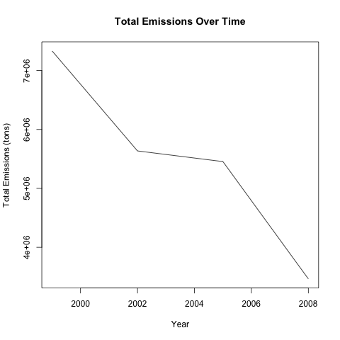
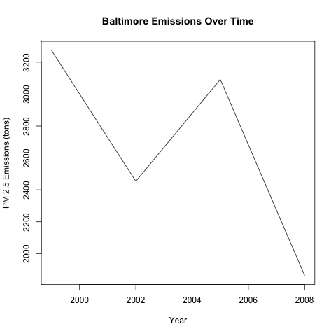
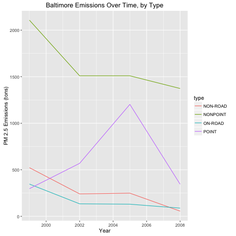
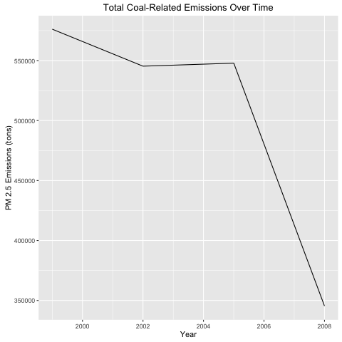
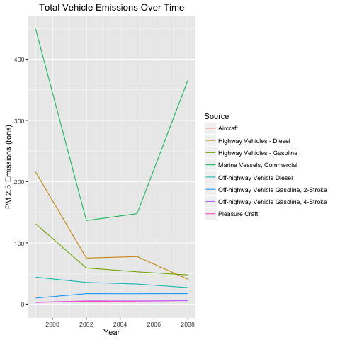
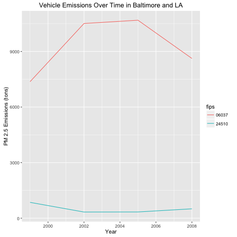

# PM2.5 Data Exploration #

This is an exploration of EPA's PM2.5 dataset. The data in question can be downloaded from [https://d396qusza40orc.cloudfront.net/exdata%2Fdata%2FNEI_data.zip](https://d396qusza40orc.cloudfront.net/exdata%2Fdata%2FNEI_data.zip).

## Some findings: ##

Overall in the US, emissions have declined from 7.3 Million tons in 1999 to 3.5 Million tons in 2008.

In Baltimore alone, emissions have declined from about 3,300 tons in 1999 to 1,900 tons in 2008.

Overall in the US, Nonpoint, On-Road and Non-Road emissions have all declined, but Point emissions have increased slightly since 1999.

In the US, Coal-related emissions have gone down, especially after 2005, from around 575,000 tons to less than 350,000 tons.

Overall pm2.5 emissions have declined since 1999, but hit a low point sometime before 2008, and then increased again. This was mostly driven by commercial Marine Vessels.

Vehicle emissions grew since 1999 in LA but declined in Baltimore. Whereas in LA they began with an increase in 2002 before declining again, in Baltimore they declined first and then increased again in 2008.